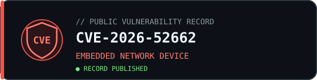
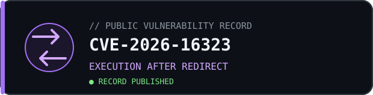
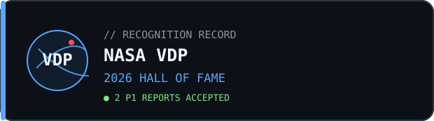
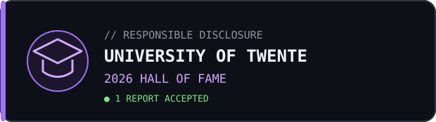
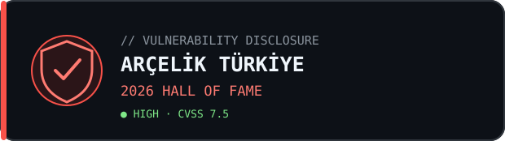
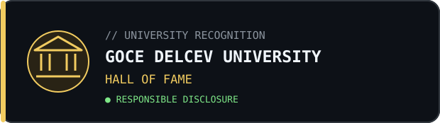
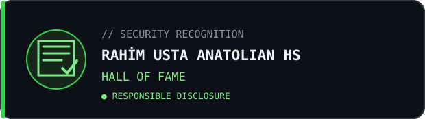

<div align="center">

```text
┌──(realkage㉿github)-[~/recognition]
└─$ whoami
Basri Akkaya — Security Researcher
```

[](https://www.basriakkaya.com)
[](https://www.linkedin.com/in/basriakkaya/)

## `cve_records.db`

<sub>Public vulnerability records · Click a record to verify</sub>

<br><br>

<a href="https://www.cve.org/CVERecord?id=CVE-2026-52662"></a>
<a href="https://www.cve.org/CVERecord?id=CVE-2026-16323"></a>

## `hall_of_fame.log`

<sub>Responsible disclosure acknowledgements · Click a record to verify</sub>

<br><br>

<a href="https://bugcrowd.com/h/realkage"></a>
<a href="https://www.utwente.nl/en/cyber-safety/responsible/hall-of-fame/"></a>
<a href="https://www.arcelikglobal.com/en/vulnerability-disclosure-hall-of-fame/2026-vulnerability-disclosure-hall-of-fame/"></a>
<a href="https://www.linkedin.com/feed/update/urn:li:activity:7470684004795437056/"></a>
<a href="https://www.linkedin.com/feed/update/urn:li:activity:7457327912598257664/"></a>

<br>

```text
[ disclosure: responsible ] [ evidence: public ] [ status: keep_hunting ]
```

</div>
